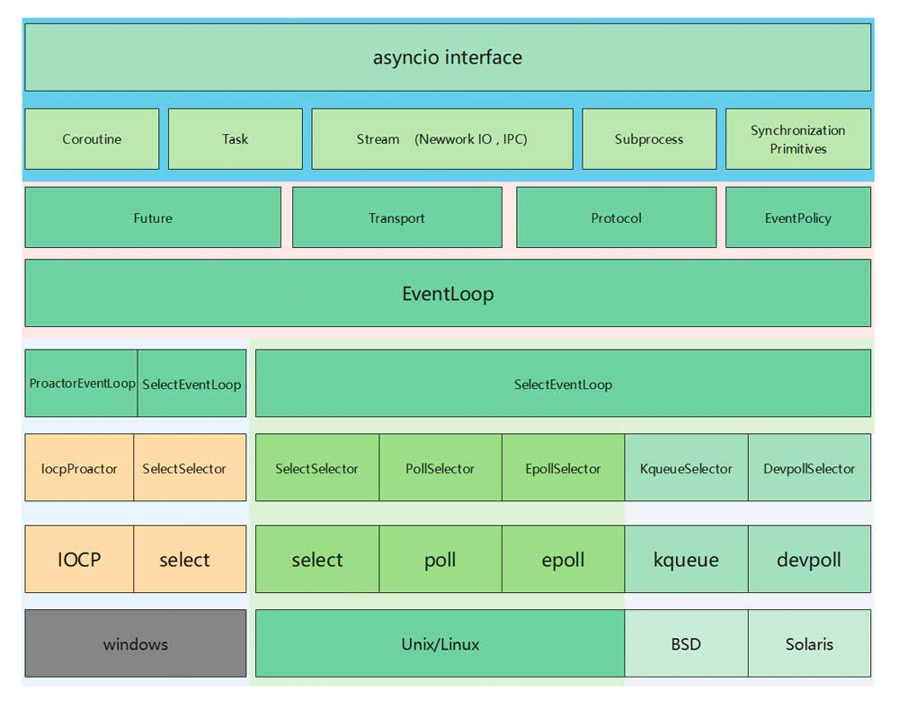

<!-- START doctoc generated TOC please keep comment here to allow auto update -->
<!-- DON'T EDIT THIS SECTION, INSTEAD RE-RUN doctoc TO UPDATE -->
**Table of Contents**  *generated with [DocToc](https://github.com/thlorenz/doctoc)*

- [简介](#%E7%AE%80%E4%BB%8B)
- [执行异步任务](#%E6%89%A7%E8%A1%8C%E5%BC%82%E6%AD%A5%E4%BB%BB%E5%8A%A1)
  - [:point_right:asyncio.**run**(*coro*, ***, *debug=None*)](#point_rightasyncioruncoro--debugnone)
  - [**:point_right:Runner**](#point_rightrunner)
- [:point_right:协程](#point_right%E5%8D%8F%E7%A8%8B)
- [:point_right:可等待的对象](#point_right%E5%8F%AF%E7%AD%89%E5%BE%85%E7%9A%84%E5%AF%B9%E8%B1%A1)
- [:point_right:创建任务](#point_right%E5%88%9B%E5%BB%BA%E4%BB%BB%E5%8A%A1)
- [:point_right:TaskGroup](#point_righttaskgroup)
- [:point_right:休眠](#point_right%E4%BC%91%E7%9C%A0)
- [:point_right:并发运行任务](#point_right%E5%B9%B6%E5%8F%91%E8%BF%90%E8%A1%8C%E4%BB%BB%E5%8A%A1)
- [协程保护](#%E5%8D%8F%E7%A8%8B%E4%BF%9D%E6%8A%A4)
- [:point_right:超时控制](#point_right%E8%B6%85%E6%97%B6%E6%8E%A7%E5%88%B6)
  - [:point_right:timeout](#point_righttimeout)
  - [:point_right:**timeout_at**](#point_righttimeout_at)
  - [**wait_for**](#wait_for)
- [简单等待](#%E7%AE%80%E5%8D%95%E7%AD%89%E5%BE%85)
- [在线程中运行](#%E5%9C%A8%E7%BA%BF%E7%A8%8B%E4%B8%AD%E8%BF%90%E8%A1%8C)
- [跨线程调度](#%E8%B7%A8%E7%BA%BF%E7%A8%8B%E8%B0%83%E5%BA%A6)
- [:point_right:内省](#point_right%E5%86%85%E7%9C%81)
- [:point_right:Task对象](#point_righttask%E5%AF%B9%E8%B1%A1)
- [流](#%E6%B5%81)
- [:point_right:lock - 锁](#point_rightlock---%E9%94%81)
- [:point_right:event - 事件](#point_rightevent---%E4%BA%8B%E4%BB%B6)
- [Condition - 条件对象](#condition---%E6%9D%A1%E4%BB%B6%E5%AF%B9%E8%B1%A1)
- [Semaphore - 信号量对象](#semaphore---%E4%BF%A1%E5%8F%B7%E9%87%8F%E5%AF%B9%E8%B1%A1)
- [BoundedSemaphore - 绑定的信号量对象](#boundedsemaphore---%E7%BB%91%E5%AE%9A%E7%9A%84%E4%BF%A1%E5%8F%B7%E9%87%8F%E5%AF%B9%E8%B1%A1)
- [Barrier - 屏障对象](#barrier---%E5%B1%8F%E9%9A%9C%E5%AF%B9%E8%B1%A1)
- [子进程集](#%E5%AD%90%E8%BF%9B%E7%A8%8B%E9%9B%86)
  - [创建子进程](#%E5%88%9B%E5%BB%BA%E5%AD%90%E8%BF%9B%E7%A8%8B)
- [队列集](#%E9%98%9F%E5%88%97%E9%9B%86)
- [:point_right:异常](#point_right%E5%BC%82%E5%B8%B8)

<!-- END doctoc generated TOC please keep comment here to allow auto update -->

# 简介

Python 异步编程的核心概念是协程（Coroutines）和事件循环（Event Loop）。

`asyncio` 模块最大特点就是，只存在一个线程

python版本：3.11

一些重要概念和用法：

1. `async` 和 `await`: `async` 关键字用于定义协程函数，`await` 关键字用于在协程中等待异步操作的完成。
2. `asyncio`: Python 的内置异步 I/O 框架，提供了事件循环、协程、任务和其他工具，用于编写异步代码。
3. 异步上下文管理器和异步迭代器：用于处理异步资源的管理和异步迭代操作。
4. 异步任务和异步队列：用于处理并发的异步任务和消息队列。
5. 异步编程模式：包括回调（Callback）、协程（Coroutines）、Future 和 Task 等多种异步编程模式。



> 图片来自于网络

# 执行异步任务

## :point_right:asyncio.**run**(*coro*, ***, *debug=None*)

```python
async def main():
    await asyncio.sleep(1)
    print('hello')

asyncio.run(main()
```

## **:point_right:Runner**

```python
async def main():
    await asyncio.sleep(1)
    print('hello')

with asyncio.Runner() as runner:
    runner.run(main())
```

- `run()` : 

  - 返回协程的结果或引发其异常。
  - 一个可选的仅限关键字的上下文参数允许为 coro 运行指定一个自定义的 contextvars.Context。如果没有，则使用运行器的默认上下文。
  - 当另一个异步事件循环在同一线程中运行时，无法调用此函数。

- `close()`:

  - 关闭runner
  - 完成异步生成器，关闭默认执行器，关闭事件循环并释放嵌入的 contextvars.Context。

- `get_loop()`:
  返回与运行器实例关联的事件循环。

# :point_right:协程

通过 async/await 语法来声明 [协程](https://docs.python.org/zh-cn/3/glossary.html#term-coroutine) 是编写 asyncio 应用的推荐方式。

```python
import asyncio

async def main():
    print('hello')
    await asyncio.sleep(1)
    print('world')

asyncio.run(main())
hello
world
```

> asyncio.run() 函数用来运行最高层级的入口点 "main()" 函数 

# :point_right:可等待的对象

如果一个对象可以在 [`await`](https://docs.python.org/zh-cn/3/reference/expressions.html#await) 语句中使用，那么它就是 **可等待** 对象。许多 asyncio API 都被设计为接受可等待对象。

*可等待* 对象有三种主要类型: **协程**, **任务** 和 **Future**.

**协程：**

- *协程函数*: 定义形式为 [`async def`](https://docs.python.org/zh-cn/3/reference/compound_stmts.html#async-def) 的函数;
- *协程对象*: 调用 *协程函数* 所返回的对象。

```python
import asyncio

async def nested():
    return 42

async def main():
    # Nothing happens if we just call "nested()".
    # A coroutine object is created but not awaited,
    # so it *won't run at all*.
    nested()

    # Let's do it differently now and await it:
    print(await nested())  # will print "42".

asyncio.run(main())
```

**任务：**

当一个协程通过 [`asyncio.create_task()`](https://docs.python.org/zh-cn/3/library/asyncio-task.html#asyncio.create_task) 等函数被封装为一个 *任务*，该协程会被自动调度执行:

```python
import asyncio

async def nested():
    return 42

async def main():
    # Schedule nested() to run soon concurrently
    # with "main()".
    task = asyncio.create_task(nested())

    # "task" can now be used to cancel "nested()", or
    # can simply be awaited to wait until it is complete:
    await task

asyncio.run(main())
```

**Futures**

Future 是一种特殊的 低层级 可等待对象，表示一个异步操作的 最终结果。

通常情况下 **没有必要** 在应用层级的代码中创建 Future 对象。

# :point_right:创建任务

asyncio.create_task(coro, *, name=None, context=None)

- 将 coro 协程 封装为一个 Task 并调度其执行。返回 Task 对象。

- name 不为 None，它将使用 Task.set_name() 来设为任务的名称。

该任务会在 get_running_loop() 返回的循环中执行，如果当前线程没有在运行的循环则会引发 RuntimeError。

```python
background_tasks = set()

for i in range(10):
    task = asyncio.create_task(some_coro(param=i))

    # Add task to the set. This creates a strong reference.
    background_tasks.add(task)

    # To prevent keeping references to finished tasks forever,
    # make each task remove its own reference from the set after
    # completion:
    task.add_done_callback(background_tasks.discard)
```

# :point_right:TaskGroup

*class* asyncio.**TaskGroup**

- 持有一组任务的异步上下文管理器。 可以使用 create_task() 将任务添加到组中。 当上下文管理器退出时，等待所有任务。

- create_task(*coro*, ***, *name=None*, *context=None*)
  - 在此任务组中创建任务。 签名与 asyncio.create_task() 的签名匹配。

```python
async def main():
    async with asyncio.TaskGroup() as tg:
        task1 = tg.create_task(some_coro(...))
        task2 = tg.create_task(another_coro(...))
    print("Both tasks have completed now.")
```

# :point_right:休眠

*coroutine* asyncio.**sleep**(*delay*, *result=None*)

- 阻塞 *delay* 指定的秒数。
- 如果指定了 *result*，则当协程完成时将其返回给调用者。
- `sleep()` 总是会挂起当前任务，以允许其他任务运行。
- 将 delay 设为 0 将提供一个经优化的路径以允许其他任务运行。 这可供长期间运行的函数使用以避免在函数调用的全过程中阻塞事件循环。

```python
import asyncio
import datetime

async def display_date():
    loop = asyncio.get_running_loop()
    end_time = loop.time() + 5.0
    while True:
        print(datetime.datetime.now())
        if (loop.time() + 1.0) >= end_time:
            break
        await asyncio.sleep(1)

asyncio.run(display_date())
```

# :point_right:并发运行任务

awaitable asyncio.gather(*aws, return_exceptions=False)

- 并发 运行 aws 序列中的 可等待对象。

- 如果 aws 中的某个可等待对象为协程，它将自动被作为一个任务调度。

- 如果所有可等待对象都成功完成，结果将是一个由所有返回值聚合而成的列表。结果值的顺序与 aws 中可等待对象的顺序一致。

- 如果 return_exceptions 为 False (默认)，所引发的首个异常会立即传播给等待 gather() 的任务。aws 序列中的其他可等待对象 不会被取消 并将继续运行。

- 如果 return_exceptions 为 True，异常会和成功的结果一样处理，并聚合至结果列表。

- 如果 gather() 被取消，所有被提交 (尚未完成) 的可等待对象也会 被取消。

```python
import asyncio

async def factorial(name, number):
    f = 1
    for i in range(2, number + 1):
        print(f"Task {name}: Compute factorial({number}), currently i={i}...")
        await asyncio.sleep(1)
        f *= i
    print(f"Task {name}: factorial({number}) = {f}")
    return f

async def main():
    # Schedule three calls *concurrently*:
    L = await asyncio.gather(
        factorial("A", 2),
        factorial("B", 3),
        factorial("C", 4),
    )
    print(L)

asyncio.run(main())

# Expected output:
#
#     Task A: Compute factorial(2), currently i=2...
#     Task B: Compute factorial(3), currently i=2...
#     Task C: Compute factorial(4), currently i=2...
#     Task A: factorial(2) = 2
#     Task B: Compute factorial(3), currently i=3...
#     Task C: Compute factorial(4), currently i=3...
#     Task B: factorial(3) = 6
#     Task C: Compute factorial(4), currently i=4...
#     Task C: factorial(4) = 24
#     [2, 6, 24]
```

# 协程保护

*awaitable* asyncio.**shield**(*aw*)

- 保护一个 可等待对象 防止其被 取消。

```python
task = asyncio.create_task(something())
try:
    res = await shield(task)
except CancelledError:
    res = None
```

# :point_right:超时控制

## :point_right:timeout

*coroutine* asyncio.**timeout**(*delay*)

- 一个异步上下文管理器，可用于限制等待某事所花费的时间。
- delay 可以是 None，也可以是等待的 float/int 秒数。 如果 delay 为 None，则不会应用时间限制； 如果在创建上下文管理器时延迟未知，这将很有用。

```python
async def main():
    try:
        async with asyncio.timeout(10):
            await long_running_task()
    except TimeoutError:
        print("The long operation timed out, but we've handled it.")

    print("This statement will run regardless.")
```

大致逻辑

- **when**() → [float](https://docs.python.org/zh-cn/3/library/functions.html#float) | [None](https://docs.python.org/zh-cn/3/library/constants.html#None)

  Return the current deadline, or `None` if the current deadline is not set.

- **reschedule**(*when: [float](https://docs.python.org/zh-cn/3/library/functions.html#float) | [None](https://docs.python.org/zh-cn/3/library/constants.html#None)*)

  Reschedule the timeout.

- **expired**() → [bool](https://docs.python.org/zh-cn/3/library/functions.html#bool)

  Return whether the context manager has exceeded its deadline (expired).

## :point_right:**timeout_at**

*coroutine* asyncio.**timeout_at**(*when*)

- 除了 when 是停止等待的绝对时间，或者 None。

```python
async def main():
    loop = get_running_loop()
    deadline = loop.time() + 20
    try:
        async with asyncio.timeout_at(deadline):
            await long_running_task()
    except TimeoutError:
        print("The long operation timed out, but we've handled it.")

    print("This statement will run regardless.")
```

## **wait_for**

*coroutine* asyncio.**wait_for**(*aw*, *timeout*)

- 等待 aw 可等待对象 完成，指定 timeout 秒数后超时。
- 如果 aw 是一个协程，它将自动被作为任务调度。
- timeout 可以为 None，也可以为 float 或 int 型数值表示的等待秒数。如果 timeout 为 None，则等待直到完成。

```python
async def eternity():
    # Sleep for one hour
    await asyncio.sleep(3600)
    print('yay!')

async def main():
    # Wait for at most 1 second
    try:
        await asyncio.wait_for(eternity(), timeout=1.0)
    except TimeoutError:
        print('timeout!')

asyncio.run(main())

# Expected output:
#
#     timeout!
```

# 简单等待

*coroutine* asyncio.**wait**(*aws*, ***, *timeout=None*, *return_when=ALL_COMPLETED*)

- 在 aws 可迭代对象中同时运行 Future 和 Task 实例并阻塞直到 return_when 指定的条件。

```python
import asyncio

async def task1():
    await asyncio.sleep(1)
    print("Task 1 completed")

async def task2():
    await asyncio.sleep(2)
    print("Task 2 completed")

async def main():
    # 创建一个事件循环
    loop = asyncio.get_event_loop()

    # 定义要等待的协程任务列表
    tasks = [task1(), task2()]

    # 使用 asyncio.wait 等待任务完成
    done, pending = await asyncio.wait(tasks, timeout=3)

    # 打印已完成的任务
    for task in done:
        print("Completed task:", task)

    # 取消未完成的任务
    for task in pending:
        task.cancel()

    # 关闭事件循环
    loop.close()

# 运行主协程
asyncio.run(main())
```

asyncio.as_completed(aws, *, timeout=None)

- 并发地运行 aws 可迭代对象中的 可等待对象。 返回一个协程的迭代器。 所返回的每个协程可被等待以从剩余的可等待对象的可迭代对象中获得最早的下一个结果。

```python
import asyncio

async def task1():
    await asyncio.sleep(1)
    return "Task 1"

async def task2():
    await asyncio.sleep(2)
    return "Task 2"

async def main():
    # 创建一个事件循环
    loop = asyncio.get_event_loop()

    # 定义要等待的协程任务列表
    tasks = [task1(), task2()]

    # 使用 asyncio.as_completed 迭代任务的完成顺序
    for coro in asyncio.as_completed(tasks):
        result = await coro
        print("Completed task:", result)

    # 关闭事件循环
    loop.close()

# 运行主协程
asyncio.run(main())
```

# 在线程中运行

coroutine asyncio.to_thread(func, /, *args, **kwargs)

- 在不同的线程中异步地运行函数 func。
- 向此函数提供的任何 *args 和 **kwargs 会被直接传给 func。 并且，当前 contextvars.Context 会被传播，允许在不同的线程中访问来自事件循环的上下文变量。
- 返回一个可被等待以获取 func 的最终结果的协程。

```python
def blocking_io():
    print(f"start blocking_io at {time.strftime('%X')}")
    # Note that time.sleep() can be replaced with any blocking
    # IO-bound operation, such as file operations.
    time.sleep(1)
    print(f"blocking_io complete at {time.strftime('%X')}")

async def main():
    print(f"started main at {time.strftime('%X')}")

    await asyncio.gather(
        asyncio.to_thread(blocking_io),
        asyncio.sleep(1))

    print(f"finished main at {time.strftime('%X')}")


asyncio.run(main())

# Expected output:
#
# started main at 19:50:53
# start blocking_io at 19:50:53
# blocking_io complete at 19:50:54
# finished main at 19:50:54
```

# 跨线程调度

asyncio.run_coroutine_threadsafe(coro, loop)

- 向指定事件循环提交一个协程。（线程安全）
- 返回一个 concurrent.futures.Future 以等待来自其他 OS 线程的结果。
- 此函数应该从另一个 OS 线程中调用，而非事件循环运行所在线程。

```python
import asyncio
import concurrent.futures

# 定义一个简单的协程
async def my_coroutine():
    print("Running in coroutine")
    await asyncio.sleep(1)
    return "Coroutine Result"

# 定义一个回调函数
def callback(fut):
    print("Callback called with result:", fut.result())

# 在另一个线程中执行协程
def run_coroutine():
    loop = asyncio.new_event_loop()  # 创建一个新的事件循环
    asyncio.set_event_loop(loop)  # 设置当前线程的事件循环
    fut = asyncio.run_coroutine_threadsafe(my_coroutine(), loop)  # 在指定的事件循环中执行协程
    fut.add_done_callback(callback)  # 添加回调函数

# 创建一个线程并启动
with concurrent.futures.ThreadPoolExecutor() as executor:
    executor.submit(run_coroutine)
    # 此处可以继续执行其他任务
```

# :point_right:内省

- asyncio.current_task(loop=None)
  - 返回当前运行的 Task 实例，如果没有正在运行的任务则返回 None。
  - 如果 loop 为 None 则会使用 get_running_loop() 获取当前事件循环。

- asyncio.all_tasks(loop=None)
  - 返回事件循环所运行的未完成的 Task 对象的集合。
  - 如果 loop 为 None，则会使用 get_running_loop() 获取当前事件循环。

- asyncio.iscoroutine(obj)
  - Return True if obj is a coroutine object.

# :point_right:Task对象

class asyncio.**Task**(*coro*, ***, *loop=None*, *name=None*)

- `done()`
  - 如果 Task 对象 已完成 则返回 True。
  -  当 Task 所封包的协程返回一个值、引发一个异常或 Task 本身被取消时，则会被认为 已完成。

- `result()`
  - 返回 Task 的结果。
  - 如果 Task 对象 已完成，其封包的协程的结果会被返回 (或者当协程引发异常时，该异常会被重新引发。)
  - 如果 Task 对象 被取消，此方法会引发一个 CancelledError 异常。
  - 如果 Task 对象的结果还不可用，此方法会引发一个 InvalidStateError 异常。

- `exception()`

  - 返回 Task 对象的异常。

  - 如果所封包的协程引发了一个异常，该异常将被返回。如果所封包的协程正常返回则该方法将返回 None。


  - 如果 Task 对象 被取消，此方法会引发一个 CancelledError 异常。


  - 如果 Task 对象尚未 完成，此方法将引发一个 InvalidStateError 异常。


- `add_done_callback`(callback, *, context=None)
  - 添加一个回调，将在 Task 对象 完成 时被运行。
  - 此方法应该仅在低层级的基于回调的代码中使用。

  - 要了解更多细节请查看 Future.add_done_callback() 的文档。

- `remove_done_callback`(callback)
  - 从回调列表中移除 callback 。
  - 此方法应该仅在低层级的基于回调的代码中使用。

  - 要了解更多细节请查看 Future.remove_done_callback() 的文档。

- `get_stack`**(***, *limit=None*)

  返回此 Task 对象的栈框架列表。如果所封包的协程未完成，这将返回其挂起所在的栈。如果协程已成功完成或被取消，这将返回一个空列表。如果协程被一个异常终止，这将返回回溯框架列表。框架总是从按从旧到新排序。每个被挂起的协程只返回一个栈框架。可选的 *limit* 参数指定返回框架的数量上限；默认返回所有框架。返回列表的顺序要看是返回一个栈还是一个回溯：栈返回最新的框架，回溯返回最旧的框架。(这与 traceback 模块的行为保持一致。)

- `print_stack`(***, *limit=None*, *file=None*)

  打印此 Task 对象的栈或回溯。此方法产生的输出类似于 traceback 模块通过 [`get_stack()`](https://docs.python.org/zh-cn/3/library/asyncio-task.html#asyncio.Task.get_stack) 所获取的框架。*limit* 参数会直接传递给 [`get_stack()`](https://docs.python.org/zh-cn/3/library/asyncio-task.html#asyncio.Task.get_stack)。The *file* argument is an I/O stream to which the output is written; by default output is written to [`sys.stdout`](https://docs.python.org/zh-cn/3/library/sys.html#sys.stdout).

- `get_coro`()

  返回由 [`Task`](https://docs.python.org/zh-cn/3/library/asyncio-task.html#asyncio.Task) 包装的协程对象。*3.8 新版功能.*

- `get_name`()

  返回 Task 的名称。如果没有一个 Task 名称被显式地赋值，默认的 asyncio Task 实现会在实例化期间生成一个默认名称。*3.8 新版功能.*

- `set_name`(*value*)

  设置 Task 的名称。*value* 参数可以为任意对象，它随后会被转换为字符串。在默认的 Task 实现中，名称将在任务对象的 [`repr()`](https://docs.python.org/zh-cn/3/library/functions.html#repr) 输出中可见。*3.8 新版功能.*

- **cancel**(*msg=None*)

  请求取消 Task 对象。

- **cancelled**()

  如果 Task 对象 *被取消* 则返回 `True`。

- **uncancel**()

​		减少对此任务的取消请求计数。

- **cancelling**()
  - 返回此 Task 的未决取消请求数，即调用 [`cancel()`]

# 流

https://docs.python.org/zh-cn/3/library/asyncio-stream.html#

```python
import asyncio

async def tcp_echo_client(message):
    reader, writer = await asyncio.open_connection(
        '127.0.0.1', 8888)

    print(f'Send: {message!r}')
    writer.write(message.encode())
    await writer.drain()

    data = await reader.read(100)
    print(f'Received: {data.decode()!r}')

    print('Close the connection')
    writer.close()
    await writer.wait_closed()

asyncio.run(tcp_echo_client('Hello World!'))
```

# :point_right:lock - 锁

*class* asyncio.**Lock**

- 实现一个用于 asyncio 任务的互斥锁。 非线程安全。

- *coroutine* **acquire**()

  获取锁。此方法会等待直至锁为 *unlocked*，将其设为 *locked* 并返回 `True`。当有一个以上的协程在 [`acquire()`](https://docs.python.org/zh-cn/3/library/asyncio-sync.html#asyncio.Lock.acquire) 中被阻塞则会等待解锁，最终只有一个协程会被执行。锁的获取是 *公平的*: 被执行的协程将是第一个开始等待锁的协程。

- **release**()

  释放锁。当锁为 *locked* 时，将其设为 *unlocked* 并返回。如果锁为 *unlocked*，则会引发 [`RuntimeError`](https://docs.python.org/zh-cn/3/library/exceptions.html#RuntimeError)。

- **locked**()

  如果锁为 *locked* 则返回 `True`。

```python
lock = asyncio.Lock()

# ... later
async with lock:
    # access shared state
    
# 等价于
await lock.acquire()
try:
    # access shared state
finally:
    lock.release()
```

# :point_right:event - 事件

*class* asyncio.**Event**

- 事件对象。 该对象不是线程安全的。
- asyncio 事件可被用来通知多个 asyncio 任务已经有事件发生。
- Event 对象会管理一个内部旗标，可通过 [`set()`](https://docs.python.org/zh-cn/3/library/asyncio-sync.html#asyncio.Event.set) 方法将其设为 *true* 并通过 [`clear()`](https://docs.python.org/zh-cn/3/library/asyncio-sync.html#asyncio.Event.clear) 方法将其重设为 *false*。 [`wait()`](https://docs.python.org/zh-cn/3/library/asyncio-sync.html#asyncio.Event.wait) 方法会阻塞直至该旗标被设为 *true*。 该旗标初始时会被设为 *false*

- *coroutine* **wait**()

  等待直至事件被设置。如果事件已被设置，则立即返回 `True`。 否则将阻塞直至另一个任务调用 [`set()`](https://docs.python.org/zh-cn/3/library/asyncio-sync.html#asyncio.Event.set)。

- **set**()

  设置事件。所有等待事件被设置的任务将被立即唤醒。

- **clear**()

  清空（取消设置）事件。通过 [`wait()`](https://docs.python.org/zh-cn/3/library/asyncio-sync.html#asyncio.Event.wait) 进行等待的任务现在将会阻塞直至 [`set()`](https://docs.python.org/zh-cn/3/library/asyncio-sync.html#asyncio.Event.set) 方法被再次调用。

- **is_set**()

  如果事件已被设置则返回 `True`。

```python
async def waiter(event):
    print('waiting for it ...')
    await event.wait()
    print('... got it!')

async def main():
    # Create an Event object.
    event = asyncio.Event()

    # Spawn a Task to wait until 'event' is set.
    waiter_task = asyncio.create_task(waiter(event))

    # Sleep for 1 second and set the event.
    await asyncio.sleep(1)
    event.set()

    # Wait until the waiter task is finished.
    await waiter_task

asyncio.run(main())
```

# Condition - 条件对象

*class* asyncio.**Condition**(*lock=None*)

- 条件对象。 该对象不是线程安全的。

- *coroutine* **acquire**()

  获取下层的锁。此方法会等待直至下层的锁为 *unlocked*，将其设为 *locked* 并返回 returns `True`。

- **notify**(*n=1*)

  唤醒最多 *n* 个正在等待此条件的任务（默认为 1 个）。 如果没有任务正在等待则此方法为空操作。锁必须在此方法被调用前被获取并在随后被快速释放。 如果通过一个 *unlocked* 锁调用则会引发 [`RuntimeError`](https://docs.python.org/zh-cn/3/library/exceptions.html#RuntimeError)。

- **locked**()

  如果下层的锁已被获取则返回 `True`。

- **notify_all**()

  唤醒所有正在等待此条件的任务。此方法的行为类似于 [`notify()`](https://docs.python.org/zh-cn/3/library/asyncio-sync.html#asyncio.Condition.notify)，但会唤醒所有正在等待的任务。锁必须在此方法被调用前被获取并在随后被快速释放。 如果通过一个 *unlocked* 锁调用则会引发 [`RuntimeError`](https://docs.python.org/zh-cn/3/library/exceptions.html#RuntimeError)。

- **release**()

  释放下层的锁。当在未锁定的锁上发起调用时，会引发 [`RuntimeError`](https://docs.python.org/zh-cn/3/library/exceptions.html#RuntimeError)。

- *coroutine* **wait**()

  等待直至收到通知。当此方法被调用时如果调用方任务未获得锁，则会引发 [`RuntimeError`](https://docs.python.org/zh-cn/3/library/exceptions.html#RuntimeError)。这个方法会释放下层的锁，然后保持阻塞直到被 [`notify()`](https://docs.python.org/zh-cn/3/library/asyncio-sync.html#asyncio.Condition.notify) 或 [`notify_all()`](https://docs.python.org/zh-cn/3/library/asyncio-sync.html#asyncio.Condition.notify_all) 调用所唤醒。 一旦被唤醒，Condition 会重新获取它的锁并且此方法将返回 `True`。

- *coroutine* **wait_for**(*predicate*)

  等待直到目标值变为 *true*。目标必须为一个可调用对象，其结果将被解读为一个布尔值。 最终的值将为返回值。

```python
cond = asyncio.Condition()

# ... later
async with cond:
    await cond.wait()
    
# 等价于
await cond.acquire()
try:
    await cond.wait()
finally:
    cond.release()
```

# Semaphore - 信号量对象

*class* asyncio.**Semaphore**(*value=1*)

- 信号量对象。 该对象不是线程安全的。

- *coroutine* **acquire**()

  获取一个信号量。如果内部计数器的值大于零，则将其减一并立即返回 `True`。 如果其值为零，则会等待直到 [`release()`](https://docs.python.org/zh-cn/3/library/asyncio-sync.html#asyncio.Semaphore.release) 并调用并返回 `True`。

- **locked**()

  如果信号量对象无法被立即获取则返回 `True`。

- **release**()

  释放一个信号量对象，将内部计数器的值加一。 可以唤醒一个正在等待获取信号量对象的任务。不同于 [`BoundedSemaphore`](https://docs.python.org/zh-cn/3/library/asyncio-sync.html#asyncio.BoundedSemaphore)，[`Semaphore`](https://docs.python.org/zh-cn/3/library/asyncio-sync.html#asyncio.Semaphore) 允许执行的 `release()` 调用多于 `acquire()` 调用。

```python
sem = asyncio.Semaphore(10)

# ... later
async with sem:
    # work with shared resource
 
# 等价于
# ... later
await sem.acquire()
try:
    # work with shared resource
finally:
    sem.release()
```

# BoundedSemaphore - 绑定的信号量对象

*class* asyncio.**BoundedSemaphore**(*value=1*)

- 绑定的信号量对象。 该对象不是线程安全的。BoundedSemaphore 是特殊版本的 [`Semaphore`](https://docs.python.org/zh-cn/3/library/asyncio-sync.html#asyncio.Semaphore)，如果在 [`release()`](https://docs.python.org/zh-cn/3/library/asyncio-sync.html#asyncio.Semaphore.release) 中内部计数器值增加到初始 *value* 以上它将引发一个 [`ValueError`](https://docs.python.org/zh-cn/3/library/exceptions.html#ValueError)。

# Barrier - 屏障对象

class* asyncio.**Barrier**(*parties*)

- 屏障对象。 不是线程安全的。

```python
async def example_barrier():
   # barrier with 3 parties
   b = asyncio.Barrier(3)

   # create 2 new waiting tasks
   asyncio.create_task(b.wait())
   asyncio.create_task(b.wait())

   await asyncio.sleep(0)
   print(b)

   # The third .wait() call passes the barrier
   await b.wait()
   print(b)
   print("barrier passed")

   await asyncio.sleep(0)
   print(b)

asyncio.run(example_barrier())
```

# 子进程集

用的时候再看 https://docs.python.org/zh-cn/3/library/asyncio-subprocess.html#

## 创建子进程

*coroutine* asyncio.**create_subprocess_exec**(*program*, **args*, *stdin=None*, *stdout=None*, *stderr=None*, *limit=None*, ***kwds*)

- 创建一个子进程。

*coroutine* asyncio.**create_subprocess_shell**(*cmd*, *stdin=None*, *stdout=None*, *stderr=None*, *limit=None*, ***kwds*)

- 运行 *cmd* shell 命令。

*class* asyncio.subprocess.**Process**

- 一个用于包装 `create_subprocess_exec()` and `create_subprocess_shell()` 函数创建的 OS 进程的对象。

```python
import asyncio
import sys

async def get_date():
    code = 'import datetime; print(datetime.datetime.now())'

    # Create the subprocess; redirect the standard output
    # into a pipe.
    proc = await asyncio.create_subprocess_exec(
        sys.executable, '-c', code,
        stdout=asyncio.subprocess.PIPE)

    # Read one line of output.
    data = await proc.stdout.readline()
    line = data.decode('ascii').rstrip()

    # Wait for the subprocess exit.
    await proc.wait()
    return line

date = asyncio.run(get_date())
print(f"Current date: {date}")
```

# 队列集

https://docs.python.org/zh-cn/3/library/asyncio-queue.html#

*class* asyncio.**Queue**(*maxsize=0*)

- 先进，先出（FIFO）队列

*class* asyncio.**PriorityQueue**

- 优先级队列
- 条目通常是 `(priority_number, data)` 形式的元组。

asyncio.**LifoQueue**

- 后进先出队列

# :point_right:异常

https://docs.python.org/zh-cn/3/library/asyncio-exceptions.html

